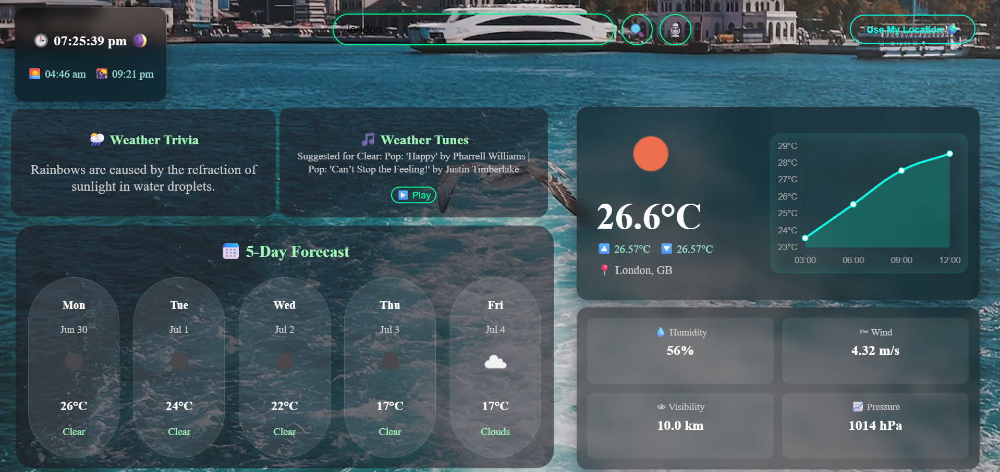
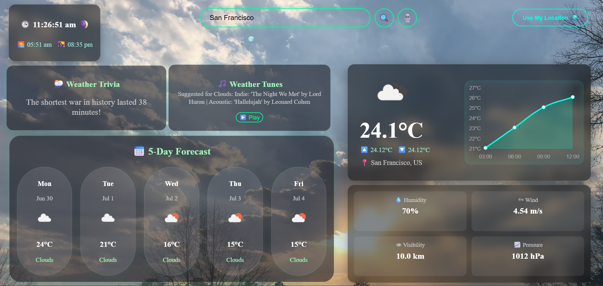

<h1 align="center">🌤️ Weather Vibe</h1>

  A beautifully animated, voice-enabled weather app built with <strong>React</strong> and <strong>OpenWeatherMap API</strong>. Featuring dynamic weather visuals, sunrise/sunset transitions, music recommendations, and more.

  

  

---

## 🔥 Features

- 🎤 Voice Search with Web Speech API
- 📍 Geolocation-based Weather Data
- 🌅 Live Sunrise & Sunset Times
- 🎬 Dynamic Background Videos by Weather
- 📈 Hourly Temperature Graph (Curved)
- 🔮 5-Day Forecast with Hover Info
- 🎵 Music Suggestions Based on Weather
- 📚 Weather Trivia and Fun Facts
- 🌐 Fully Responsive & Clean UI

---

## 🧠 Tech Stack

| Layer       | Tools                                 |
|-------------|----------------------------------------|
| Frontend    | React + Vite                          |
| Styling     | CSS3 (glassmorphism, animations)      |
| Charts      | Chart.js (for hourly temperature graph)|
| API         | OpenWeatherMap API                    |
| Voice Input | Web Speech API                        |

---

## 📂 Folder Structure

src/
├── assets/
│ └── images/, videos/
├── components/
│ ├── WeatherCard.jsx
│ ├── ForecastCard.jsx
│ ├── SunriseSunset.jsx
│ ├── TimeSunriseWidget.jsx
│ ├── WeatherMusicPlayer.jsx
│ └── WeatherOverlay.jsx
├── App.jsx
├── App.css
└── index.js

---

## 🧠 How It Works

1. On page load, a default looping video plays as background.
2. You can either:
   - Type in a city
   - Speak the city name 🎤
   - Click "Use My Location"
3. Once weather is fetched:
   - 🎬 Background changes
   - ⛅ Animated overlays trigger
   - 📈 Graph displays hourly temps
   - 🎶 Music suggestions & trivia appear

---

🌐 Live Demo
Live Demo Link <!-- Optional: Replace with real link if deployed -->

🙏 Credits
OpenWeatherMap API

Chart.js

React

Background videos: Pexels / Coverr

📄 License
MIT License © Abhijit Mukherjee
